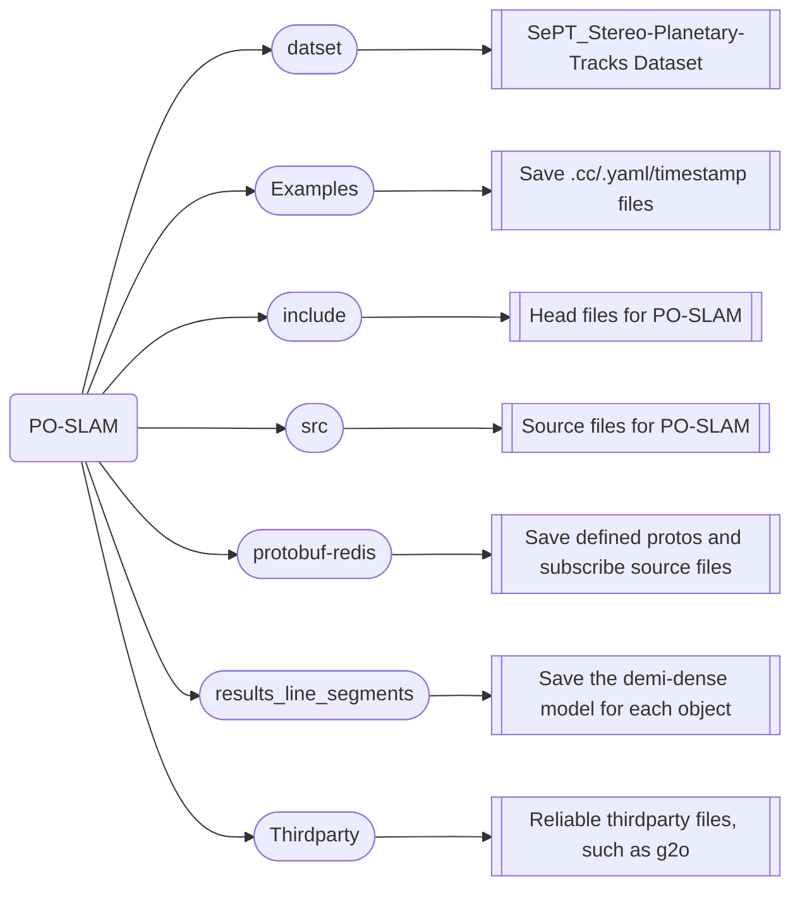

# PO-SLAM: Planetary target-Oriented Simultaneous Localization and Mapping

  **intro:** This repo proposes a SAM-augmented target-oriented SLAM framework that enables planetary rovers to identify target, estimate the relative position, and reconstruct/represent the target from abstraction to precision. This object SLAM algorithms can work in an unstructured, weakly textured, and lunar terrain environment.

  

## 1. Structure



## 2. Quick Running
### 2.1 Prerequisites
+ Prerequisites are the same as [**EAO-SLAM**](https://github.com/yanmin-wu/EAO-SLAM). If compiling problems met, please refer to semidense-lines and ORB_SLAM2.
+ The code is tested in Ubuntu 20.04, opencv 3.4.4, Eigen 3.3.7, boost 1.63.0.
+ Open source dataset: [**SePT Dataset**](https://github.com/miaTian99/SePT_Stereo-Planetary-Tracks) 
### 2.2 Building
```
chmod +x build.sh
./build.sh
``` 
### 2.3 Running demo
```
bash sept_examples.sh
``` 
or
``` 
./Path_to_executeFile DataAssoParam ./Path_to_vocabularyFile ./Path_to_yaml Path_to_DataFolder ./Path_to_timestampFile
``` 
### 2.4 Results

> The mean matching accuracy figure based on SOTA matching baselines:


> Object instances extraction results:


> Trajectories's results (camera positioning):

<!-- <figure>
  <p align="center" >
    
  </p>
</figure> -->


> Trajectories's results (relative positioning):


> Rocks reconstruction results:

<figure>
  <p align="center" >
    
  </p>
</figure> 
&nbsp;

### 2.5 Eval
+ CameraTrajectory[EuRoC]: save in [evo_output](https://github.com/miaTian99/PO-SLAM/blob/main/evo_output)
+ ObjectRelativePoses[EuRoC]: save in [evo_output](https://github.com/miaTian99/PO-SLAM/blob/main/evo_output)
+ Line3D++: save in [results_line_segments](https://github.com/miaTian99/PO-SLAM/blob/main/results_line_segments)
+ Related cmds are shown in: [evo_output/evo_cmd.txt](https://github.com/miaTian99/PO-SLAM/blob/main/evo_output/evo_cmd.txt)
## 3. Examples
### 3.1 Input Stereo images

> The PO-SLAM inputs stereo images (stereo baseline: 150mm)

<figure>
  <p align="center" >
    
  </p>
</figure> 
&nbsp;

### 3.2 Prepare object extraction for data association

> The patch2pix is utilized for image matching (left camera), an example result is: 


> The keypoints work as prompt in SAM, then we got:

<figure>
  <p align="center" >
    
  </p>
</figure>
&nbsp;

> As shown in left image above, the minimum bounding boxes (i.e., [objectID, x, y, w, h, confidence]) are obtained and saved as txt files, which can be used as offline input for PO-SLAM. 

> PS: these boxes can generate 1FPS by running protobuf+redis scripts ([subscribe_semanticStereo.cc](https://github.com/miaTian99/PO-SLAM/blob/main/protobuf-redis/src/subscribe_semanticStereo.cc).

### 3.3 Run PO-SLAM for Lunar01(SePT01)

  ```
  ./build.sh
  bash sept_examples.sh
  ``` 
or
  ```
  ./build.sh
  ./Examples/Stereo/stereo_SePT EAO ./Vocabulary/ORBvoc.bin ./Examples/Stereo/SePT01.yaml ./dataset/SePT/SePT01 ./Examples/Stereo/TimeStamps/SePT01.txt
  ```
> The running demo is like: 


### 3.4 Results

+ CameraTrajectory: save in [evo_output](https://github.com/miaTian99/PO-SLAM/blob/main/evo_output)
+ ObjectRelativePoses: save in [evo_output](https://github.com/miaTian99/PO-SLAM/blob/main/evo_output)
+ Semi-dense reconstruction for Rock1: save in [results_line_segments](https://github.com/miaTian99/PO-SLAM/blob/main/results_line_segments)

## 4. Video
-  Local: the demo video is saved in 902
- demo: [Youtube](https://youtu.be/zQ4hKNucBUo)
## 5. Notes
-  First time before running: remove all cmake build files in all folders
- Defualt execute file is: [stereo_SePT.cc](https://github.com/miaTian99/PO-SLAM/blob/main/Examples/Stereo/stereo_SePT.cc)
- Defualt segmentFusion image: left camera
- Defualt protoFile and its execute file are located in: [offline_bbox.proto](https://github.com/miaTian99/PO-SLAM/blob/main/protobuf-redis/proto/offline_bbox.proto) and [subscribe_semanticStereo.cc](https://github.com/miaTian99/PO-SLAM/blob/main/protobuf-redis/src/subscribe_semanticStereo.cc)
- To record logs, please use:

    ```
    bash sept_examples.sh > log.txt
    ``` 

## 6. Acknowledgement
Thanks to following works: [**Image-Matching-Toolbox**](https://github.com/GrumpyZhou/image-matching-toolbox), [**SAM**](https://github.com/facebookresearch/segment-anything), and [**EAO-SLAM**](https://github.com/yanmin-wu/EAO-SLAM).
- (**Patch2Pix**) Q. Zhou, T. Sattler and L. Leal-Taixé, "Patch2Pix: Epipolar-Guided Pixel-Level Correspondences," CVPR 2021, Nashville, TN, USA, 2021, pp. 4667-4676. [Paper](https://arxiv.org/abs/2012.01909/). 
- (**SAM**) Kirillov, Alexander and Mintun, Eric and Ravi, Nikhila and et al., "Segment Anything," 2023, CoRR. [paper](https://ai.meta.com/research/publications/segment-anything/).
- (**EAO-SLAM**) Y. Wu, Y. Zhang, D. Zhu, Y. Feng, S. Coleman and D. Kerr, "EAO-SLAM: Monocular Semi-Dense Object SLAM Based on Ensemble Data Association," IROS 2020, Las Vegas, NV, USA, 2020, pp. 4966-4973. [Paper](https://ieeexplore.ieee.org/abstract/document/9341757).

##  7. Contact
- Author: Yaolin Tian (email: tianyaolin21@mails.ucas.ac.cn)
-  Corresponding author:  [Xue Wan*](https://people.ucas.ac.cn/~wanxue), Email:  [wanxue@csu.ac.cn](mailto:wanxue@csu.ac.cn)
- The paper is under submitting

    ```
    @article{Yaolin2024,
      title={LO-SLAM: Lunar Object-centric SLAM using Point Prompted SAM for Data Association},
      author={Yaolin Tian, Xue Wan, Shengyang Zhang, Jianhong Zuo, Yadong Shao, and Mengmeng Yang},
      year={2024},
      eprinttype={techRxiv},
      doi={10.36227/techrxiv.170975343.37379344/v1}
    }
    ```